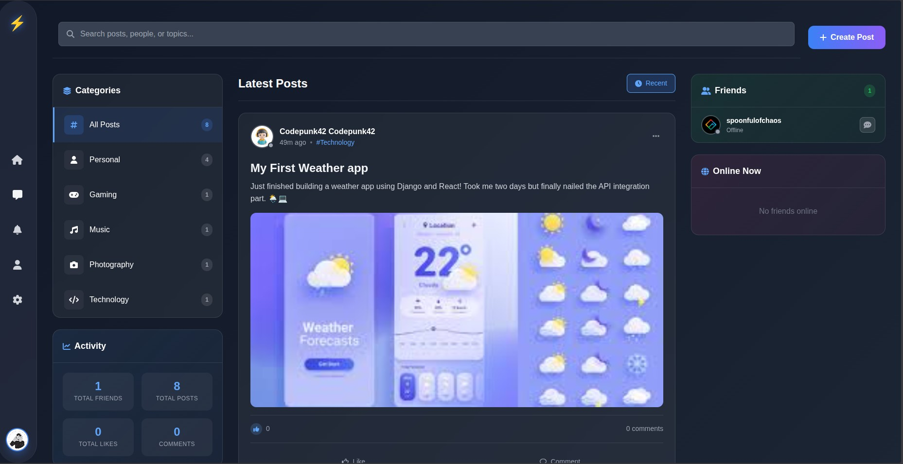
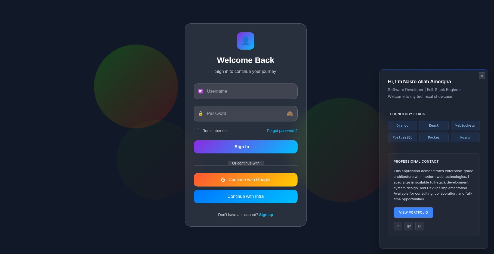
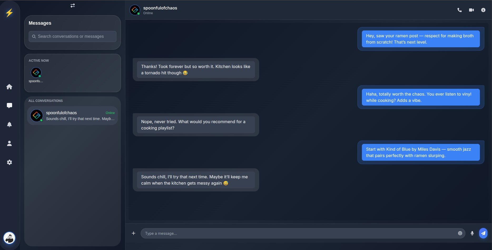

# 🌌 Nanovers

**Nanovers** is a full-stack social media web app built around the idea of a “nano universe” — a space where users can connect, post, chat, and interact in a clean and secure environment.

### 🚀 Live Demo
🔗 [https://nanovers.org](https://nanovers.org)

---

## 🛠️ Tech Stack

- **Frontend:** React.js, Tailwind CSS
- **Backend:** Django, Django REST Framework
- **Authentication:** JWT + 2FA
- **Real-Time Features:** WebSocket (Django Channels)
- **Deployment:** Docker, Nginx

---

## ✨ Features

- 🧑‍🚀 User Signup/Login with 2FA
- 📬 Real-time chat system
- 📝 Create and share posts
- 🔔 Notifications
- 💬 Comment & like system
- 🛡️ Secure architecture (no public data exposure)
- 📱 Responsive UI

---

## 🔒 Why Code Is Private

This project is live and includes user data and authentication logic.  
For security and privacy, the source code is not publicly available.

If you're a recruiter or developer and want to know more, feel free to contact me at:

📧 nassrelahamorgha514@gmail.com 
🌐 [namorgha.github.io](https://namorgha.github.io)

---

## 📸 Screenshots

| Home Page | Signin Section | Real-Time Chat |
|-----------|--------------|----------------|
|  |  |  |

---
